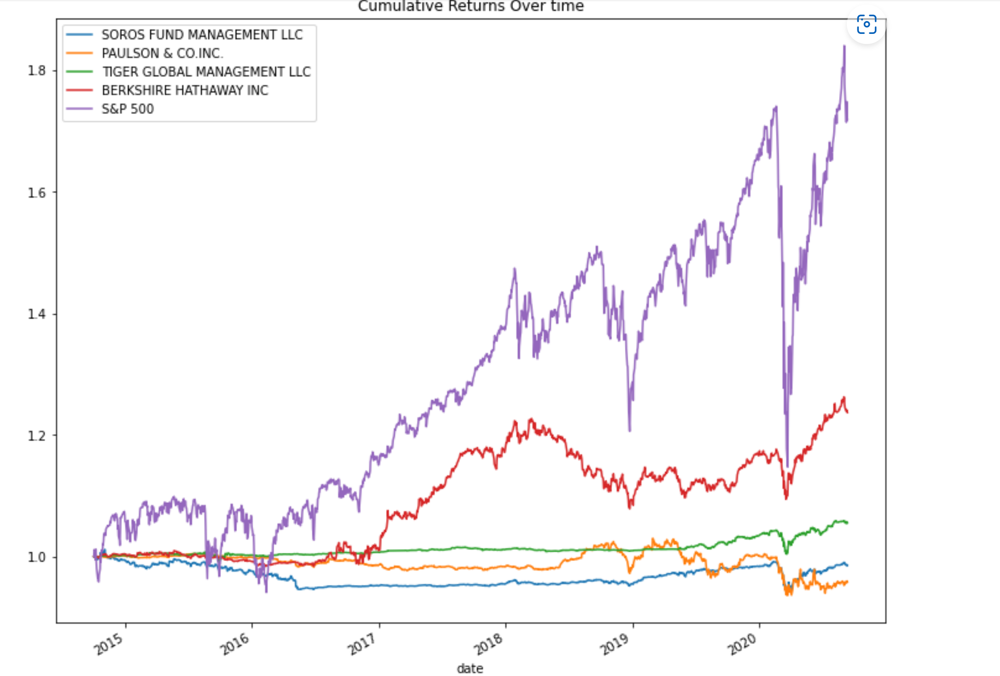
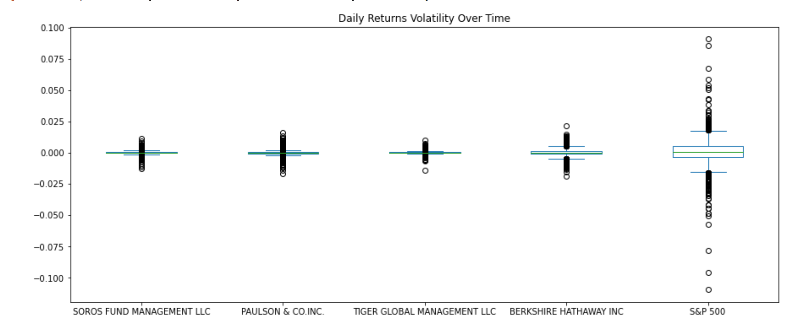
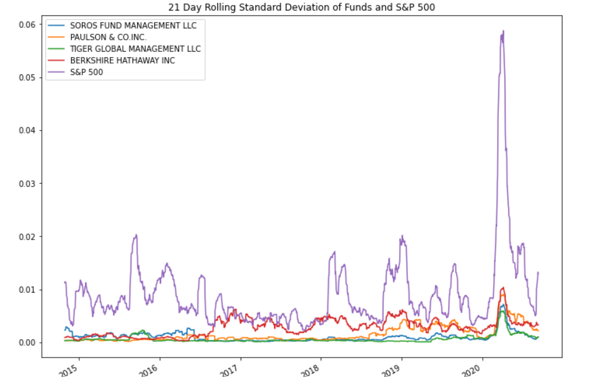
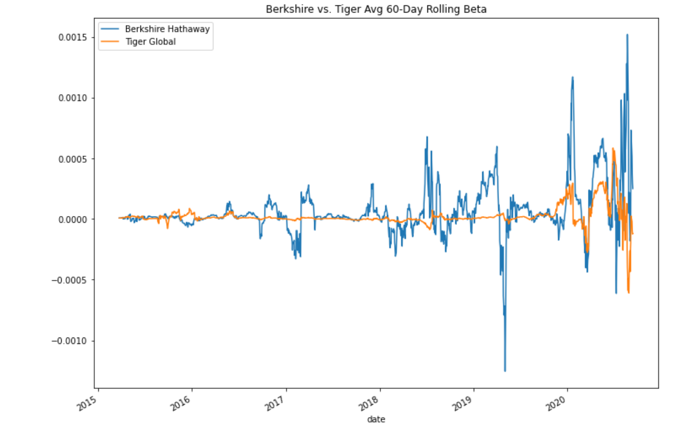

# Portfolio Risk Analysis Tool

## Use Case
This  application calculates the risk of assets using metrics and statistical methods to calculate portfolio performance.

### Data Used
The application reads financial data from a CSV.

    whale_navs.csv

---
## Technologies
### Python:

    Phyton Version: **3.7.13**

### CSV:
[csv](https://docs.python.org/3/library/csv.html)

### Pandas
[Pandas](https://pandas.pydata.org/pandas-docs/stable/reference/api/pandas.DataFrame.html) 

### Matplotlib
[Matplotlib](https://matplotlib.org/stable/api/_as_gen/matplotlib.pyplot.plot.html)

---
## How to run

1. Clone this repository from Github
2. Open Jupyter lab and open the file
3. Run all cells

---
## Usage

### Cumulative Returns Over Time:

### Volatility of Returns of Over Time:

### 21 Day Rolling Standard Deviation of Funds:

### Sharpe Ratios of Funds and S&P 500:

### 60 day rolling Beta: Berkshire Hathaway:

---
## Contributors
UW FinTech Bootcamp
- Startup code provided by program

---
## License
Portfolio Risk Analysis tool is available under an MIT License.

---
## Aknowledgements
* [Markdown Guide](https://www.markdownguide.org/basic-syntax/#reference-style-links)

<!-- MARKDOWN LINKS & IMAGES -->
<!-- https://www.markdownguide.org/basic-syntax/#reference-style-links -->